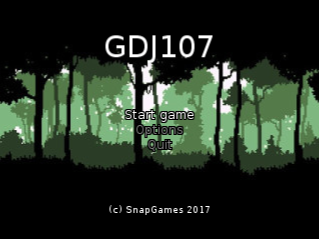

# GDJ110

[](https://travis-ci.org/SnapGames/GDJ110 "open the TravisCI compilation trend") [](https://www.versioneye.com/user/projects/59dd5fd72de28c2198ef86e9 "Open on VersionEye")

## Game Development Java Basics 110

This project is part of the [GDJ100](https://classroom.google.com/c/NzI2ODQ3NjU2MFpa/t/NzI2Nzg0MjgxNFpa) course from [GameDev Basics
Java](https://classroom.google.com/c/NzI2ODQ3NjU2MFpa "Open the official on-line course") 
provided by the [SnapGames](http://snapgames.fr) site. 

### Goal

Propose an intepretation of the famous ParticleSystem game engine pattern to add special effects capabilities to the core.
This will implement Rain effect.

## Compile

To compile the full project, please execute the following command :

```bash
    $> mvn clean install
```

## Execute the game

- **On any platform (Linux, MacOS, Windows)**

to execute the compiled jar, please execute the command bellow :

```bash
    $> mvn exec:java
```

or :

```bash
    $> java -jar GDJ110-0.0.1-SNAPSHOT-jar-with-dependencies.jar
```

- **Specifically to Windows platform**

To build a windows executable file, you must run :

```bat
    C:\> mvn clean install site
```

This will build a `GDJ110.exe` into the `target` directory.

Then you can directly execute :

```bat
    C:\> target/GDJ110.exe
```

If needed, you can also add some arguments from the bellow table:

| argument | short  |  sample     | default | Description                                   |
|:--------:|:------:|:-----------:|:-------:|:----------------------------------------------|
| --debug  |   -d   |  -d \[0-4\] | 0       | Request debug information with the level      |
| --height |   -h   |  -h 320     | 320     | Set the width of the window                   |
| --width  |   -w   |  -w 240     | 240     | Set the height of the window                  |
| --scale  |   -s   |  -s 2       | 2       | Set a scale factor for the window             |
| --full   |   -f   |  -f         | off     | switch to fullscreen mode                     |

Executing the following line bello:

```bat
    C:/> target/GDJ110.exe -d 1
```

will open the next window :




## Edit

Import this project as an Existing Maven Project into your prefered IDE, 
(like [Eclipse](http://www.eclipse.org/downloads "open the eclipse official web download page") ?)


## Some screen shots ?

### States

> TODO

## Maven Repo ?

To publish to the right maven repo, just execute the following lines:

```bash
    $> mvn clean site deploy
```

Before execution, be sure that your `settings.xml` contains a `server` entry with your login/password for the github repository.

	<servers>
		<server>
			<id>github</id>
			<username>[GITHUB-USERNAME]</username>
			<password>[GITHUB-USERPASSWORD]</password>
		</server>
	</servers>

Have Fun !

Send a mail to [SnapGames](mailto:contact@snapgames.fr?subject=GDJ110 "send a mail to your tutor")


